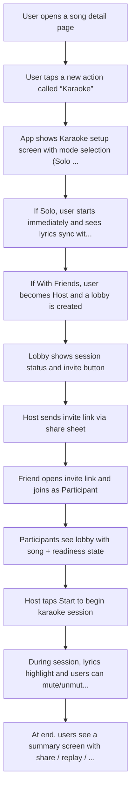

# Flow: HYxtgE7EARWuvTskijY7xa

> Generated: 2026-01-27T02:43:58.766Z
> Grammar Version: 1.0.0

## Summary

### Goals
- Let users sing along with synchronized lyrics for any supported song
- Support both Solo Karaoke and With Friends Karaoke
- Minimize time-to-first-lyric (fast entry from a song page)
- Make joining a friend session effortless via link
- Provide a delightful “session” feeling (lobby, ready states, shared experience)
- Keep the feature safe, respectful, and privacy-first

### Personas
- **Casual Listener**: wants a fun, low-pressure way to sing along without needing talent
- **Karaoke Host**: wants to start a session fast and invite friends with minimal setup
- **Friend Participant**: wants to join instantly from an invite link and know what to do next
- **Competitive Singer**: wants scoring, stats, and bragging rights (optional mode)
- **Social Sharer**: wants clips/screenshots/results to share after the session
- **Privacy-Conscious User**: wants control over microphone use and recording, with clear consent

## User Flow

## Requirements

### Functional
- Karaoke mode must display real-time synchronized lyrics with highlighting
- Karaoke mode must support Solo mode
- Karaoke mode must support With Friends mode (real-time session)
- Host can create a karaoke session from a song
- Host can invite friends using a shareable link
- Participant can join session from invite link
- Lobby must show who joined and who is ready
- Session must have a clear Start action controlled by the host
- Users can mute/unmute themselves during the session
- Users can leave session at any time without breaking the session
- App must request microphone permission only when needed and explain why
- Karaoke should be usable even if mic permission is denied (lyrics-only mode)
- App must handle network latency gracefully (allow slight desync + reconnection)
- App must show clear feedback for loading, syncing, and connection issues
- Competitive scoring mode is optional and can be enabled per session

## Open Questions
- [ ] Do we record audio at all, or is it a purely live sing-along experience?
- [ ] Is With Friends playback truly synchronized or “best-effort” with tolerance?
- [ ] Do we need a host at all times, or can sessions be hostless?
- [ ] Do we support duets / rotating solo lines, or everyone sings everything?
- [ ] Should sessions support video, or audio-only, or lyrics-only?
- [ ] Do we support scoring in v1? If yes, what model and what feedback UI?
- [ ] Where does Karaoke live in the Spotify IA (song page, now playing, search)?
- [ ] How do we handle explicit lyrics / content controls in group sessions?
- [ ] What is the max participant count for a good experience?

## Notes
- [Unparsed E:] User joins session late (mid-song) — should sync to current lyric position
- [Unparsed E:] Microphone permission denied — user can still continue in lyrics-only mode
- [Unparsed E:] Host disconnects — session should either pause, transfer host, or end gracefully
- [Unparsed E:] Participant disconnects — they should be able to rejoin quickly
- [Unparsed E:] Bad network causes lyric desync — show “resync” option and continue playback
- [Unparsed E:] Song unavailable in region — Karaoke entry should explain and offer alternatives
- [Unparsed E:] Invite link expired or invalid — show friendly recovery path
- [Unparsed E:] Too many participants — enforce a session cap and communicate why
- [Unparsed E:] User receives a call/audio interruption — resume experience smoothly
- [Unparsed E:] Abusive participant — allow report + leave + block actions
- CONTEXT:
- Project: Spotify Karaoke
- Client: Spotify
- OutputSlug: spotify_karaoke
- Version: v1
- Date: 2026-01-26
- Owner: Blue
- Platform: Mobile (iOS + Android)
- Goal: Sing along to songs solo or with friends
- Constraints: Privacy-first, low friction entry, works with imperfect network
- Sticky
- Sticky
- Sticky
- Sticky
- Sticky
- Sticky
- Sticky
