# Flow: HYxtgE7EARWuvTskijY7xa

> Generated: 2026-02-05T13:40:12.301Z
> Grammar Version: 2.0.0

## Summary

### Goals
- Let users sing along with synchronized lyrics for any supported song
- Support both Solo Karaoke and With Friends Karaoke
- Minimize time-to-first-lyric (fast entry from a song page)
- Make joining a friend session effortless via link
- Provide a delightful “session” feeling (lobby, ready states, shared experience)
- Keep the feature safe, respectful, and privacy-first
- Enable users to sing along to songs solo or with friends
- Provide a fast, low-friction entry into karaoke from a song
- Preserve privacy and consent around microphone use
- Support imperfect networks with graceful degradation

### Personas
- **Casual Listener**: wants a low-pressure, no-judgment karaoke experience
- **Karaoke Host**: wants to start a session fast and invite friends easily
- **Friend Participant**: wants to join instantly and understand what to do next
- **Competitive Singer**: wants scoring and performance feedback (optional)
- **Social Sharer**: wants results or clips to share after a session
- **Privacy-Conscious User**: wants control over mic usage and recording

### Context
- Project = Spotify Karaoke
- Client = Spotify
- OutputSlug = spotify_karaoke
- Version = v1
- Platform = Mobile (iOS, Android)
- Owner = Blue

## User Flow

```mermaid
flowchart TD

  %% Steps
  S1["User opens a song detail page"]
  S2["User taps a new action called “Karaoke”"]
  S3["App shows Karaoke setup screen with mode selection (Solo ..."]
  S4["If Solo, user starts immediately and sees lyrics sync wit..."]
  S5["If With Friends, user becomes Host and a lobby is created"]
  S6["Lobby shows session status and invite button"]
  S7["Host sends invite link via share sheet"]
  S8["Friend opens invite link and joins as Participant"]
  S9["Participants see lobby with song + readiness state"]
  S10["Host taps Start to begin karaoke session"]
  S11["During session, lyrics highlight and users can mute/unmut..."]
  S12["At end, users see a summary screen with share / replay / ..."]
  S1["User opens a song detail page"]
  S2["User taps “Karaoke”"]
  S3["User selects Solo Karaoke mode"]
  S4["Start Solo Karaoke with live lyrics + mic input"]
  S5["Start Solo Karaoke in lyrics-only mode"]
  H1["Host taps “Karaoke”"]
  H2["Host selects “With Friends”"]
  H3["Host enters lobby with mic enabled"]
  H4["Host enters lobby in lyrics-only mode"]
  H5["Host shares invite link"]
  H8["Host waits in lobby"]
  H9["Host starts Karaoke session"]
  G1["Guest joins lobby"]
  G2["Guest joins with mic enabled"]
  G3["Guest joins in lyrics-only mode"]
  G4["Participate in karaoke session"]

  %% Decisions
  D1{"Is Karaoke supported for this song?"}
  D2{"Is microphone permission granted?"}
  D3{"Is microphone permission granted?"}
  D4{"How does host invite friends?"}
  D5{"Are participants ready?"}
  D6{"Is invite link valid?"}
  D7{"Is microphone permission granted?"}
  D8{"Has host started the session?"}

  %% Edges
  D1 -->|"Yes"| S3
  D1 -->|"No"| N_END_EXIT
  D2 -->|"Yes"| S4
  D2 -->|"No"| S5
  D3 -->|"Yes"| H3
  D3 -->|"No"| H4
  D4 -->|"Share Sheet"| N_H6
  D4 -->|"Copy Link"| N_H7
  D5 -->|"Yes"| H9
  D5 -->|"No"| H8
  D6 -->|"Yes"| G1
  D6 -->|"No"| N_END_ERROR
  D7 -->|"Yes"| G2
  D7 -->|"No"| G3
  D8 -->|"Yes"| G4
  D8 -->|"No"| G1
```

## Requirements

### Functional
- Karaoke mode must display real-time synchronized lyrics with highlighting
- Karaoke mode must support Solo mode
- Karaoke mode must support With Friends mode (real-time session)
- Host can create a karaoke session from a song
- Host can invite friends using a shareable link
- Participant can join session from invite link
- Lobby must show who joined and who is ready
- Session must have a clear Start action controlled by the host
- Users can mute/unmute themselves during the session
- Users can leave session at any time without breaking the session
- App must request microphone permission only when needed and explain why
- Karaoke should be usable even if mic permission is denied (lyrics-only mode)
- App must handle network latency gracefully (allow slight desync + reconnection)
- App must show clear feedback for loading, syncing, and connection issues
- Competitive scoring mode is optional and can be enabled per session

## Open Questions
- [ ] Is audio recorded or purely live?
- [ ] Is group playback strict-sync or best-effort?
- [ ] Is a host required at all times?
- [ ] Do we support duets or rotating solos?
- [ ] Should sessions support video, or audio-only, or lyrics-only?
- [ ] Do we support scoring in v1? If yes, what model and what feedback UI?
- [ ] Where does Karaoke live in the Spotify IA (song page, now playing, search)?
- [ ] How do we handle explicit lyrics / content controls in group sessions?
- [ ] What is the max participant count for a good experience?
- [ ] What is the max participant count for a good experience?

## Risks
- Audio desync on low-end devices
- Abuse in group sessions
- Privacy concerns around microphone usage

## Notes
- Sticky
- Sticky
- Sticky
- Sticky
- Sticky
- Sticky
- Sticky
