# Flow: HYxtgE7EARWuvTskijY7xa

> Generated: 2026-02-06T04:38:02.836Z
> Grammar Version: 2.0.0

## Summary

### Goals
- Enable bite-sized live language practice sessions from a smart watch
- Allow users to quickly ask a tutor a question or practice a phrase
- Minimize time-to-connection with a tutor
- Support hands-free and glanceable interactions
- Allow seamless escalation from watch → phone when needed
- Respect privacy, consent, and recording transparency
- Practice a foreign language with a live tutor through quick, on-the-go interactions
- Enable users to get immediate, situational language help at the exact moment they need it.
- Make live language practice feel lightweight, approachable, and non-disruptive to daily life.
- Allow users to confidently communicate in real-world situations without committing to long lessons.
- Seamlessly bridge micro-interactions on a smart watch into deeper learning experiences on mobile when needed.

### Personas
- **Traveler Learner**: wants quick language help while navigating a foreign country
- **Busy Professional**: wants short, focused practice sessions between meetings
- **Language Beginner**: wants reassurance, corrections, and simple explanations
- **Advanced Learner**: wants nuanced phrasing, pronunciation feedback, and cultural tips
- **Tutor**: wants to deliver helpful micro-lessons without context switching
- **Privacy-Conscious User**: wants control over audio recording and session history

### Context
- Project = Smart Watch Language Tutor
- Client = Preply
- OutputSlug = smartwatch_language_tutor
- Version = v1
- Platform = Smart Watch (Apple Watch + Wear OS) + Companion Mobile App
- Owner = Blue

## User Flow

```mermaid
flowchart TD

  %% Steps
  S1["User opens the language tutor app on smart watch"]
  S2["User launches the app from a watch complication"]
  S3["User selects “Practice a Phrase”"]
  S4["User selects “Ask a Question”"]
  S5["User selects “Join Scheduled Lesson”"]
  S6["User speaks a phrase or question into the watch"]
  S7["User reviews a suggested phrase or prompt"]
  S8["User confirms intent to connect with a tutor"]
  S9["User listens to tutor feedback or explanation"]
  S10["User repeats a phrase after tutor guidance"]
  S11["User chooses to continue session on mobile phone"]
  S12["User ends or exits the session"]
  QP1["User opens language tutor app on smart watch"]
  QP6["Live audio session begins with tutor"]
  QP8["Tutor provides pronunciation correction"]
  AQ1["User taps “Ask a Question”"]
  AQ5["Live audio session begins"]
  AQ7["App suggests switching to phone for extended help"]
  SM1["User taps “Join Lesson”"]
  SM2["Tutor begins short structured exercise"]
  SM4["User responds verbally to prompts"]
  SM6["App suggests continuing lesson on phone"]

  %% Decisions
  D1{"Is a tutor available?"}
  D2{"Is microphone permission granted?"}
  D3{"Is microphone permission granted?"}
  D4{"Is a tutor available?"}
  D5{"Does user need additional clarification?"}
  D6{"Is network connection stable?"}
  D7{"Is lesson exceeding watch-friendly du..."}

  %% Auto-generated edges (no explicit E: edges found)
  S1 --> S2
  S2 --> S3
  S3 --> S4
  S4 --> S5
  S5 --> S6
  S6 --> S7
  S7 --> S8
  S8 --> S9
  S9 --> S10
  S10 --> S11
  S11 --> S12
  S12 --> QP1
  QP1 --> QP6
  QP6 --> QP8
  QP8 --> AQ1
  AQ1 --> AQ5
  AQ5 --> AQ7
  AQ7 --> SM1
  SM1 --> SM2
  SM2 --> SM4
  SM4 --> SM6
  SM6 --> D1
  D1 --> D2
  D2 --> D3
  D3 --> D4
  D4 --> D5
  D5 --> D6
  D6 --> D7
```

## Requirements

### Functional
- App must support live audio sessions with a tutor
- App must support ultra-short sessions (30s–5min)
- App must allow users to ask a single question or practice a phrase
- App must display minimal visual cues optimized for watch screens
- App must support push-to-talk and hands-free modes
- App must gracefully handle poor or intermittent connectivity
- App must allow users to switch to phone for longer sessions
- App must request microphone permission just-in-time with explanation
- App must allow practice without recording by default
- App must show tutor availability in near real-time
- App must provide lightweight session summaries after completion

## Open Questions
- [ ] Are sessions recorded or ephemeral by default?
- [ ] Do tutors see user location/context (city, country)?
- [ ] Can users request the same tutor repeatedly for micro-sessions?
- [ ] What is the max recommended session length on watch?
- [ ] Do we support text input at all on watch?
- [ ] How do we price or meter ultra-short tutor interactions?
- [ ] What happens if tutor availability is low?
- [ ] How much context should persist between sessions?

## Risks
- Network instability may interrupt live audio sessions, degrading the learning experience or causing frequent exits.
- Smart watch screen and input constraints may limit users’ ability to understand feedback or corrections from tutors.
- Low tutor availability during peak travel hours could result in repeated failed connection attempts, increasing user frustration.
