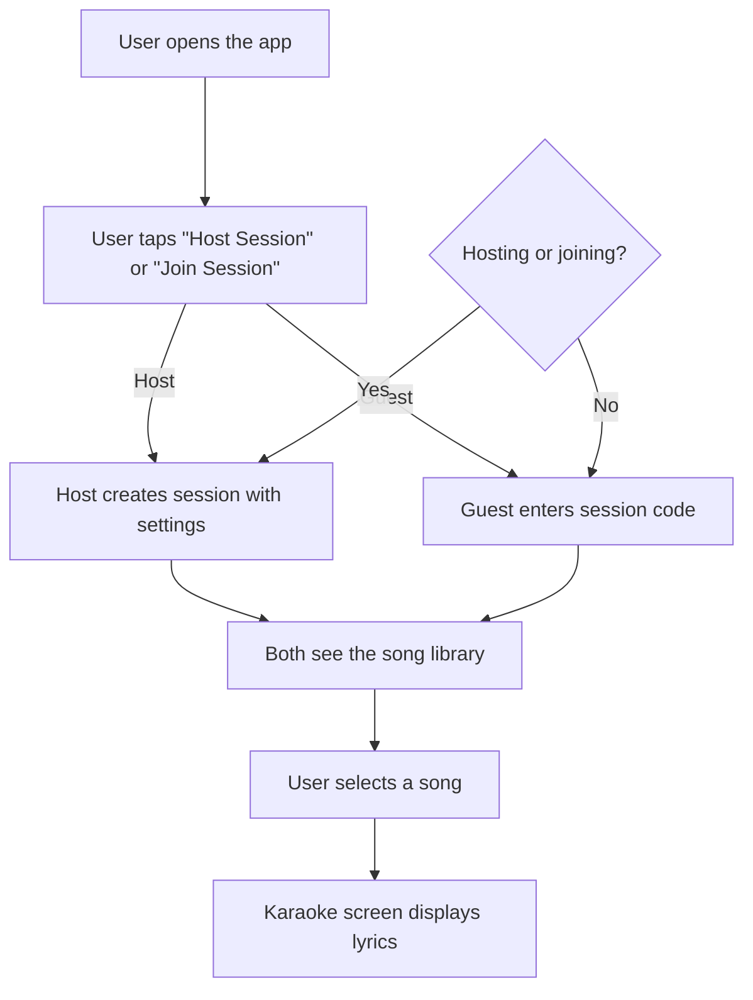

# BluePrints Card Grammar Example

This file demonstrates the BluePrints Card Grammar with labeled sticky note content and the resulting Mermaid flow diagram.

## Input: Labeled Sticky Notes

Below are example sticky notes using the card grammar:

```
CTX: Mobile karaoke app for social gatherings
G: Allow users to host and join karaoke sessions
P: Host - organizes karaoke nights for friends and family
P: Guest - joins sessions to sing along

S: (S1) User opens the app
S: (S2) User taps "Host Session" or "Join Session"
D: Hosting or joining? | yes:Create new session | no:Enter session code
S: (S3) Host creates session with settings
S: (S4) Guest enters session code
S: (S5) Both see the song library
S: (S6) User selects a song
S: (S7) Karaoke screen displays lyrics

E: S1 -> S2
E: S2 -> S3 [label=Host]
E: S2 -> S4 [label=Guest]
E: S3 -> S5
E: S4 -> S5
E: S5 -> S6
E: S6 -> S7

R: Session codes must be 6 alphanumeric characters
R: Song library must load within 2 seconds
NFR: Support 50 concurrent users per session
RISK: Network latency may affect lyrics sync
Q: Should we support offline mode for downloaded songs?
```

## Output: Mermaid Flow Diagram



## Parsed FlowSpec Summary

| Category | Items |
|----------|-------|
| Context | 1 |
| Goals | 1 |
| Personas | 2 (Host, Guest) |
| Steps | 7 |
| Decisions | 1 |
| Edges | 7 |
| Requirements | 2 functional, 1 non-functional |
| Risks | 1 |
| Questions | 1 |

## Notes

- Labels are case-insensitive: `s:` = `S:`
- Steps with IDs like `(S1)` are captured for edge references
- Edges without explicit labels auto-connect in sequence
- The decision node appears as a diamond shape in Mermaid
