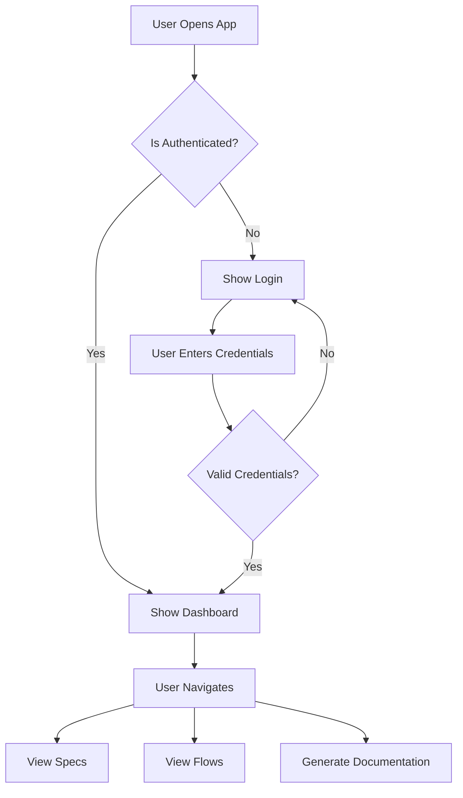

# Smoke Test - Simple Mermaid Diagram

This is a simple smoke test to verify that Mermaid diagrams can be embedded in Markdown files.

## Sample User Flow

## Description

This simple flow demonstrates:
- User authentication check
- Conditional routing based on auth state
- Basic navigation options once authenticated

This serves as a baseline example for more complex flows that will be generated by BluePrints.
